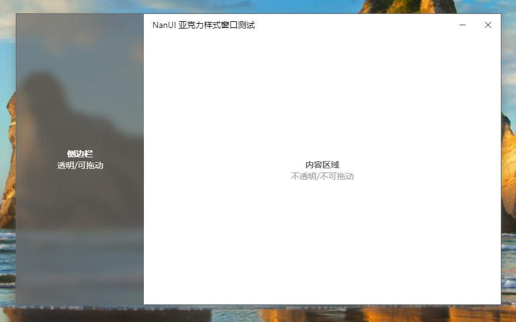

# Use Win10 Acrylic Special Effect Style Form

[[Home](README.md)]

- [Use Win10 Acrylic Special Effect Style Form](#use-win10-acrylic-special-effect-style-form)
  - [ShadowEffect Shadow effect](#shadoweffect-shadow-effect)

Acrylic effects are a new feature provided after the Windows 10 Creators Update. It allows the transparent or translucent areas of the form to be blurred and mixed with desktop elements to achieve a special matte acrylic effect.

```C#
public override HostWindowType WindowType => HostWindowType.Acrylic;
```

Acrylic special effects use CEF's off-screen rendering technology to draw off-screen rendered images onto a form with acrylic effects through Direct2D.

Because off-screen rendering cannot call GPU for graphics acceleration, the smoothness of rendering is not as smooth as that of non-off-screen rendering, and this mode cannot use WebGL to draw complex graphics.

Same as the Layered style, according to the settings of the transparent or semi-transparent area in the web page, a frosted glass effect with a specific effect will be achieved.



As in the example in the picture above, a semi-transparent pink is used in the sidebar part, and the transparent part is mixed with the acrylic part to achieve the effect on the picture. You can also specify other colors to mix with or use transparent colors to show the original effect of the acrylic window.

## ShadowEffect Shadow effect

The `ShadowEffect` property body of the Formium Acrylic Special Effect Window has four optional effects: `No Shadow`, `Halo`, `Shadow` and `Projection`.

```C#
AcrylicWindowProperties.ShadowEffect = ShadowEffect.Shadow;
```

- **None**

  No shadows. Turn off the shadow effect of the Formium window.

  

- **Glow**

  Halo effect.

  

- **Shadow**

  Shadow effect.

  

- **DropShadow**

  Projection effect.

  

The shadow also supports setting the color. Set the `ShadowColor` property to set the shadow color in the active state of the window; set the `InactiveShadowColor` property to set the shadow color in the inactive state. When `InactiveShadowColor` is set to NULL, NanUI will automatically calculate a suitable color based on the color value of `ShadowColor` for the shadow of the Formium window.

```C#
AcrylicWindowProperties.ShadowEffect = ShadowEffect.DropShadow;
AcrylicWindowProperties.ShadowColor = ColorTranslator.FromHtml("#E83B90");
AcrylicWindowProperties.InactiveShadowColor = Color.FromArgb(125, ColorTranslator.FromHtml("#666666"));
```
