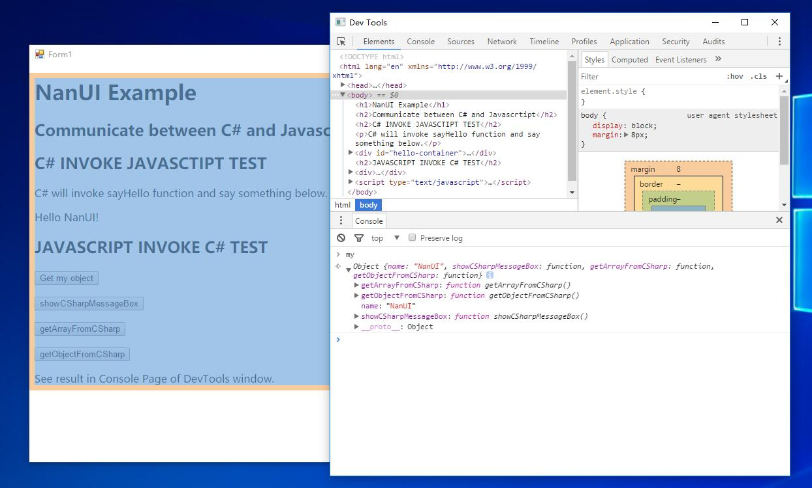

# 操作 Javascript 上下文

NanUI 基于 ChromiumFX 项目，因此与 Javascript 环境相关的内容均采用了 ChromiumFX 框架提供的接口。本文将向您展示最浅显的接口调用方式。

本章节涉及的内容

- [使用 C#调用 Javascript 方法](#使用-c调用-javascript-方法)
- [在 Javascript 环境中注册.NET对象](#在javascript环境中注册net-对象)
- [回调函数](#回调函数)

## 使用 C#调用 Javascript 方法

假设在您的 Javascript 环境中有方法`sayHello`，您可以通过.NET 环境来调用它。

```javascript
function sayHello() {
  var p = document.createElement("p");
  p.innerText = "Hello NanUI!";

  var container = document.getElementById("hello-container");
  container.appendChild(p);
}
```

在`Formium`承载窗体的任意位置，您都可以通过`WebBrowser`对象的`ExecuteJavascript`方法调用不需要返回值的 Javascript 方法。

```C#
private void LoadHandler_OnLoadEnd(object sender,CfxOnLoadEventArgs e)
{
	if(e.Frame.IsMain)
	{
		WebBrowser.ExecuteJavascript("sayHello()");
	}
}
```

您可以在网页中看到打印出来的“Hello NanUI!”字样。

另外，您还可以通过`EvaluateJavascript`来调用有返回值的 Javascript 方法，只是过程稍显复杂。

```javascript
function sayHelloTo(who) {
  return "Hello " + who + "!";
}
```

在`Formium`承载窗体的任意位置，您都可以通过`WebBrowser`对象的`EvaluateJavascript`方法调用有返回值的 Javascript 方法。

```C#
private void LoadHandler_OnLoadEnd(object sender, Chromium.Event.CfxOnLoadEndEventArgs e)
{
	// Check if it is the main frame when page has loaded.
	if(e.Frame.IsMain)
	{
		WebBrowser.EvaluateJavascript("sayHelloTo('C#')", (value, exception) =>
		{
			if(value.IsString)
			{
				// Get value from Javascript.
				var jsValue = value.StringValue;

				MessageBox.Show(jsValue);
			}
		});
	}
}
```

运行后，您将可以看到 MessageBox 中显示了来自 Javascript 中的字符串。

`CfrV8Value`是 ChromiumFX 中的重要类型，很多时候您都需要通过它来与 Javascript 环境交互。

## 在Javascript环境中注册.NET 对象

您不仅能够通过.NET 环境执行 Javascript 方法，您也可以把.NET 对象、方法等注册到 Javascript 环境中。

承载窗体的基类`Formium`类，在抽象方法`OnRegisterGlobalObject`中提供了参数`JSObject`对象，您可以通过该对象注册.NET 的值、方法。

下面的例子演示了如何通过.NET 构造一个 Javascript 的对象，其中内置了一个只读属性`name`，以及三个方法`showCSharpMessageBox`、`getArrayFromCSharp`、`getObjectFromCSharp`。

```C#
protected override void OnRegisterGlobalObject(JSObject global)
{
	//register the "my" object
	var myObject = global.AddObject("my");

	//add property "name" to my, you should implemnt the getter/setter of name property by using PropertyGet/PropertySet events.
	var nameProp = myObject.AddDynamicProperty("name");
	nameProp.PropertyGet += (prop, args) =>
	{
		// getter - if js code "my.name" executes, it'll get the string "NanUI".
		args.Retval = CfrV8Value.CreateString("NanUI");
		args.SetReturnValue(true);
	};
	nameProp.PropertySet += (prop, args) =>
	{
		// setter's value from js context, here we do nothing, so it will store or igrone by your mind.
		var value = args.Value;
		args.SetReturnValue(true);
	};


	//add a function showCSharpMessageBox
	var showMessageBoxFunc = myObject.AddFunction("showCSharpMessageBox");
	showMessageBoxFunc.Execute += (func, args) =>
	{
		//it will be raised by js code "my.showCSharpMessageBox(`some text`)" executed.
		//get the first string argument in Arguments, it pass by js function.
		var stringArgument = args.Arguments.FirstOrDefault(p => p.IsString);

		if (stringArgument != null)
		{
			MessageBox.Show(this, stringArgument.StringValue, "C# Messagebox", MessageBoxButtons.OK, MessageBoxIcon.Information);


		}
	};

	//add a function getArrayFromCSharp, this function has an argument, it will combind C# string array with js array and return to js context.
	var friends = new string[] { "Mr.JSON", "Mr.Lee", "Mr.BONG" };

	var getArrayFromCSFunc = myObject.AddFunction("getArrayFromCSharp");

	getArrayFromCSFunc.Execute += (func, args) =>
	{
		var jsArray = args.Arguments.FirstOrDefault(p => p.IsArray);


		if (jsArray == null)
		{
			jsArray = CfrV8Value.CreateArray(friends.Length);
			for (int i = 0; i < friends.Length; i++)
			{
				jsArray.SetValue(i, CfrV8Value.CreateString(friends[i]));
			}
		}
		else
		{
			var newArray = CfrV8Value.CreateArray(jsArray.ArrayLength + friends.Length);

			for (int i = 0; i < jsArray.ArrayLength; i++)
			{
				newArray.SetValue(i, jsArray.GetValue(i));
			}

			var jsArrayLength = jsArray.ArrayLength;

			for (int i = 0; i < friends.Length; i++)
			{
				newArray.SetValue(i + jsArrayLength, CfrV8Value.CreateString(friends[i]));
			}


			jsArray = newArray;
		}


		//return the array to js context

		args.SetReturnValue(jsArray);

		//in js context, use code "my.getArrayFromCSharp()" will get an array like ["Mr.JSON", "Mr.Lee", "Mr.BONG"]
	};

	//add a function getObjectFromCSharp, this function has no arguments, but it will return a Object to js context.
	var getObjectFormCSFunc = myObject.AddFunction("getObjectFromCSharp");
	getObjectFormCSFunc.Execute += (func, args) =>
	{
		//create the CfrV8Value object and the accssor of this Object.
		var jsObjectAccessor = new CfrV8Accessor();
		var jsObject = CfrV8Value.CreateObject(jsObjectAccessor);

		//create a CfrV8Value array
		var jsArray = CfrV8Value.CreateArray(friends.Length);

		for (int i = 0; i < friends.Length; i++)
		{
			jsArray.SetValue(i, CfrV8Value.CreateString(friends[i]));
		}

		jsObject.SetValue("libName", CfrV8Value.CreateString("NanUI"), CfxV8PropertyAttribute.ReadOnly);
		jsObject.SetValue("friends", jsArray, CfxV8PropertyAttribute.DontDelete);


		args.SetReturnValue(jsObject);

		//in js context, use code "my.getObjectFromCSharp()" will get an object like { friends:["Mr.JSON", "Mr.Lee", "Mr.BONG"], libName:"NanUI" }
	};
｝
```

运行项目打开 CEF 的 DevTools 窗口，在 Console 中输入`my`，您就能看到`my`对象的详细信息，请注意，这个对象来自于.NET 环境。



执行`my.showCSharpMessageBox("SOME TEXT FROM JS")`命令，将调用 C#的 MessageBox 来现实 JS 函数中提供的“SOME TEXT FROM JS”字样。

```
> my.getArrayFromCSharp()
["Mr.JSON", "Mr.Lee", "Mr.BONG"]
```

执行`my.getArrayFromCSharp()`能够从 C#中取到我们内置的字符串数组中的三个字符串。如果在函数中指定了一个数组作为参数，那么指定的这个数组将和 C#的字符串数组合并。

```
> my.getArrayFromCSharp(["Js_Bison", "Js_Dick"])
["Js_Bison", "Js_Dick", "Mr.JSON", "Mr.Lee", "Mr.BONG"]
```

## 回调函数

回调函数是 Javascript 里面重要和常用的功能，如果您在 JS 环境中注册的方法具有函数型的参数（即回调函数），通过 Execute 事件的 Arguments 可以获得回调的 function，并使用 CfrV8Value 的`ExecuteFunction`来执行回调。

```C#
//add a function with callback function

var callbackTestFunc = GlobalObject.AddFunction("callbackTest");
callbackTestFunc.Execute += (func,args)=> {
	var callback = args.Arguments.FirstOrDefault(p => p.IsFunction);
	if(callback != null)
	{
		var callbackArgs = CfrV8Value.CreateObject(new CfrV8Accessor());
		callbackArgs.SetValue("success", CfrV8Value.CreateBool(true), CfxV8PropertyAttribute.ReadOnly);
		callbackArgs.SetValue("text", CfrV8Value.CreateString("Message from C#"), CfxV8PropertyAttribute.ReadOnly);

		callback.ExecuteFunction(null, new CfrV8Value[] { callbackArgs });
	}
};
```

在 Console 中执行**callbackTest(function(result){ console.log(result); })**将执行匿名回调，并获取到 C#回传的 result 对象。

```
> callbackTest(function(result){ console.log(result); })
Object {success: true, text: "Message from C#"}
```

在大多数情况下，在 Javascript 中回调都是因为执行了一些异步的操作，那么如果这些异步的操作是在 C#执行也是可行的，只是实现起来就比较复杂。下面将演示如何实现一个异步回调。

```C#
//add a function with async callback
var asyncCallbackTestFunc = GlobalObject.AddFunction("asyncCallbackTest");
asyncCallbackTestFunc.Execute += async (func, args) => {
//save current context
var v8Context = CfrV8Context.GetCurrentContext();
var callback = args.Arguments.FirstOrDefault(p => p.IsFunction);

//simulate async methods.
await Task.Delay(5000);

if (callback != null)
{
	//get render process context
	var rc = callback.CreateRemoteCallContext();

	//enter render process
	rc.Enter();

	//create render task
	var task = new CfrTask();
	task.Execute += (_, taskArgs) =>
	{
		//enter saved context
		v8Context.Enter();

		//create callback argument
		var callbackArgs = CfrV8Value.CreateObject(new CfrV8Accessor());
		callbackArgs.SetValue("success", CfrV8Value.CreateBool(true), CfxV8PropertyAttribute.ReadOnly);
		callbackArgs.SetValue("text", CfrV8Value.CreateString("Message from C#"), CfxV8PropertyAttribute.ReadOnly);

		//execute callback
		callback.ExecuteFunction(null, new CfrV8Value[] { callbackArgs });


		v8Context.Exit();

		//lock task from gc
		lock (task)
		{
			Monitor.PulseAll(task);
		}
	};

	lock (task)
	{
		//post task to render process
		v8Context.TaskRunner.PostTask(task);
	}

	rc.Exit();

	GC.KeepAlive(task);
}
```

在 Console 中执行**asyncCallbackTest(function(result){ console.log(result); })**将执行匿名回调，大约 5 秒后获取到 C#回传的 result 对象。

```
> asyncCallbackTest(function(result){ console.log(result); })
Object {success: true, text: "Message from C#"}
```
